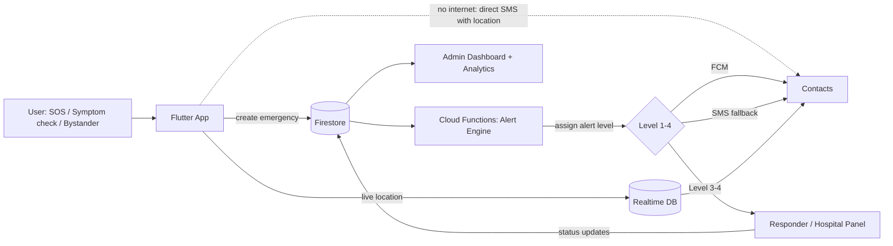

# 🚀 PROJECT_STARTER.md — SafeLife

> Filled-in project foundation for **SafeLife: A Unified Smart Emergency Response Platform for Women's Safety and Cardiovascular/Stroke Triage**.
> Copy this file into the project root, or split each section into its own file inside `/docs`
> (`PRD.md`, `architecture.md`, `design.md`, `rules.md`, `phases.doc.md`, `memory.md`).
> Items marked **TBD** need a decision from you (or a clinician/supervisor) before implementation.

---

## 📄 1. PRD.md — Product Requirement Document

### 1. What to Build

- **Product name:** SafeLife
- **One-line pitch:** One app, one-tap emergency help for women's safety threats and heart attack / stroke emergencies, with live location sent to family and responders.
- **Core purpose / problem it solves:**
  Women's safety tools and medical emergency tools exist as separate apps, which slows decisions and coordination in a crisis. SafeLife runs both on a single **unified emergency engine**: detect a situation, assess its priority, alert the right people, and share live location until help arrives.
- **Goals:**
  - *User goals:* get help within seconds, keep family informed, know when symptoms need urgent care.
  - *Project goals:* deliver a working Flutter + Firebase prototype, and measure it (alert latency, triage accuracy, usability) for the thesis.

### 2. Targeted User

- **Primary audience:** Women, elderly people, heart disease patients, stroke-risk patients.
- **Secondary audience:** Family members / emergency contacts, hospital staff, emergency responders, system administrators.
- **Their needs / pain points:**
  - Danger leaves no time to unlock a phone, open an app, and find a button.
  - Patients may be unable to operate the app during a stroke or cardiac event.
  - Families do not know where the person is or how serious the situation is.
  - Mobile data is unreliable in emergencies.
- **Use cases:**
  1. A woman feels followed at night and triggers SOS discreetly; her contacts receive her live location.
  2. An elderly user has chest pain, completes a symptom check, and is told to call emergency services with contacts alerted.
  3. A family member notices facial drooping in a relative and uses **bystander mode** to raise a stroke emergency.
  4. A user reports harassment after the fact through incident reporting.
  5. An admin reviews anonymized emergency statistics and hotspots.

### 3. Features

**Must-have (MVP)**
- [ ] User registration, login, profile — Firebase Auth (phone/email)
- [ ] Emergency contact setup with contact verification (consent from the contact)
- [ ] Medical info storage (blood group, conditions, medications, allergies)
- [ ] Smart SOS button with cancel countdown (e.g. 5 s)
- [ ] Live location sharing during an active emergency (throttled)
- [ ] Notifications to contacts via FCM **plus SMS fallback** with a map link
- [ ] Emergency case creation and case history
- [ ] Heart symptom triage with a documented scoring model
- [ ] Stroke FAST triage with **bystander mode**
- [ ] Smart Alert Engine with defined rules and escalation (Cloud Functions)
- [ ] One-tap call to national emergency numbers

**Should-have**
- [ ] Incident reporting (harassment, stalking, physical threat, violence, other) with optional photo/audio evidence
- [ ] Nearby hospital finder (Google Places)
- [ ] Alternative SOS triggers: power/volume button, shake, home-screen widget
- [ ] Timed check-in ("alert my contacts if I don't confirm arrival in N minutes")
- [ ] Bangla + English UI, large-text accessibility mode
- [ ] Lock-screen / quick-access Medical ID

**Nice-to-have**
- [ ] Ambulance request flow with status tracking (Requested → Accepted → On The Way → Arrived), **simulated partners**
- [ ] Responder / hospital web panel
- [ ] Admin dashboard: user analytics, emergency analytics, heat map (Flutter Web)
- [ ] Wearable heart-rate input (Health Connect / HealthKit)
- [ ] Fall detection using the accelerometer
- [ ] Fake-call feature, voice-keyword trigger
- [ ] Separate long-term cardiovascular risk model trained on a public dataset

**Out of scope (for now)**
- Real integration with government or hospital dispatch systems
- Diagnosis or medical treatment advice
- Video streaming, iOS-specific background hardening (unless time permits)

### 4. Success Metrics (used in thesis evaluation)

| Metric | How to measure | Target |
|---|---|---|
| Alert latency (trigger → contact notified) | Timestamps logged on device and in Cloud Functions | **TBD** (e.g. < 10 s on data) |
| SMS fallback delivery | Test with mobile data off | Delivered in **TBD** s |
| Location accuracy | Compare shared vs. actual position | **TBD** m |
| Battery drain during tracking | 30-min tracking test on 2–3 devices | **TBD** % per hour |
| Triage agreement | Rule engine output vs. clinician-labeled scenarios | **TBD** % (favor sensitivity) |
| Usability | SUS questionnaire with real participants | SUS ≥ 68 |

---

## 🏗️ 2. architecture.md — High-Level Design & Structure

### 1. Architecture

**System design overview:**
SafeLife is a client–serverless system. The Flutter app collects events (SOS, symptom checks, incident reports) and sends them to Firebase. **Cloud Functions** own the Alert Engine, so alert logic does not depend on the phone staying alive. Contacts are reached through push notifications first and SMS as a fallback.

**Key design decision:** the app is a *unified emergency engine* with pluggable emergency types (`safety`, `cardiac`, `stroke`, extendable later). Every type produces the same `Emergency` object and flows through the same alert pipeline.

**Components and how they interact:**

| Component | Responsibility |
|---|---|
| Flutter app (Provider) | UI, SOS triggers, symptom questionnaires, location capture, local offline queue |
| Firebase Auth | Identity, session management |
| Cloud Firestore | Profiles, contacts, emergencies, reports, alerts |
| Realtime Database (optional) | High-frequency live-location updates (cheaper than Firestore writes) |
| Cloud Functions | Alert Engine, escalation timers, dedup/retries, SMS dispatch, analytics aggregation |
| Firebase Cloud Messaging | Push notifications to contacts and responders |
| SMS gateway (**TBD**: Twilio / local BD provider) | Fallback alerts without internet on the recipient side |
| Google Maps / Places APIs | Map display, nearby hospitals, tracking links |
| Firebase Storage | Incident evidence (photo/audio) |
| Flutter Web panels | Admin dashboard, responder/hospital panel |
| Crashlytics | Crash and error reporting |

**Flow diagram:**



### 2. Alert Engine Rules (proposed)

| Level | Name | Trigger examples | Actions |
|---|---|---|---|
| 1 | Informational | Low-risk triage result | Show advice to user only; log the case |
| 2 | Emergency Contact Alert | User-triggered SOS (safety); Medium-risk triage | Notify all verified contacts (FCM + SMS) with type, time, location |
| 3 | High Priority | High-risk triage; Level 2 not acknowledged within **N s** | Repeat alerts, prompt user to call emergency services, show nearby hospitals |
| 4 | Critical | Critical cardiac risk; any positive FAST sign; Level 3 not acknowledged within **M s** | All channels, auto-prompt emergency call, ambulance request, responder panel notified |

Rules that apply to all levels: **deduplicate** repeated triggers for the same case, **retry** failed sends, **escalate** if no contact acknowledges, and log every step with timestamps for evaluation. `N` and `M` are configurable constants (**TBD**).

### 3. Risk Scoring Approach (to be validated by a clinician)

> ⚠️ Weights and thresholds below are placeholders. They must come from published clinical guidance and be reviewed by a doctor. Do not invent values.

- **Cardiac triage:** acute symptoms (chest pain, shortness of breath, nausea, excessive sweating, dizziness) combined with profile risk factors (age, diabetes, hypertension, smoking, prior cardiac events) produce a weighted, rule-based score mapped to Low / Medium / High / Critical.
- **Stroke triage:** FAST (Face, Arm, Speech, Time). **Any positive sign = Emergency**, with no scoring delay. Supports self-check and bystander mode.
- **Design principle:** over-triage. Favor sensitivity over specificity, and always show "Call emergency services now" for High/Critical.
- **Explainability:** every result stores the answers and the rule that fired.

### 4. Firestore Data Model (draft)

```
users/{uid}
  name, phone, bloodGroup, medicalHistory[], medications[], allergies[], language, createdAt
  contacts/{contactId}        name, phone, relation, verified, priority
emergencies/{emergencyId}
  userId, type (safety|cardiac|stroke), riskLevel, alertLevel, status (active|resolved|cancelled|false_alarm)
  createdAt, resolvedAt, lastKnownLocation{lat,lng,accuracy,ts}, triggerSource, triageAnswers{}
  alerts/{alertId}            channel (fcm|sms), recipient, status (sent|delivered|acked|failed), ts
ambulanceRequests/{requestId} emergencyId, status (requested|accepted|on_the_way|arrived), updatedAt
incidentReports/{reportId}    userId, category, description, location, evidenceUrls[], createdAt
hospitals/{hospitalId}        name, location, phone   (optional cache of Places results)
analytics/{docId}             anonymized daily aggregates written by Cloud Functions
```

Live location points go to Realtime Database under `liveLocation/{emergencyId}`, throttled (e.g. every 5–10 s), and are deleted per the retention policy.

### 5. Folder & File Structure

```
safelife/
├── lib/
│   ├── main.dart
│   ├── app/                    # app widget, routes, theme, localization
│   ├── core/
│   │   ├── constants/          # emergency numbers, alert thresholds
│   │   ├── services/           # location, sms, notification, connectivity
│   │   ├── utils/
│   │   └── widgets/            # shared UI (SOS button, cards)
│   ├── features/
│   │   ├── auth/               # data / providers / screens
│   │   ├── profile/            # medical info, emergency contacts
│   │   ├── sos/                # SOS button, countdown, live tracking
│   │   ├── incident_report/
│   │   ├── heart_triage/       # questionnaire + scoring engine
│   │   ├── stroke_triage/      # FAST + bystander mode
│   │   ├── hospitals/          # nearby hospital finder
│   │   ├── ambulance/          # request + status (simulated)
│   │   └── history/
│   └── l10n/                   # en, bn
├── functions/                  # Cloud Functions (alert engine, escalation, SMS)
├── admin_web/                  # Flutter Web: admin + responder panels
├── firebase/                   # firestore.rules, storage.rules, indexes
├── test/
├── docs/                       # PRD, architecture, design, rules, phases, memory
└── pubspec.yaml
```

### 6. Tech Stack

- **Frontend:** Flutter, Material 3
- **State management:** Provider
- **Backend:** Firebase Authentication, Cloud Firestore, Firebase Cloud Messaging, Cloud Functions, Firebase Storage, Realtime Database (live tracking)
- **Services:** Google Maps SDK, Places API, device location services, SMS gateway (**TBD**)
- **Hosting / Deployment:** Firebase Hosting for web panels; Android APK / Play internal testing for the app
- **Other tools/libraries:** Crashlytics, GitHub for version control and CI (**TBD**)

---

## 🎨 3. design.md — UI/UX Guidelines & Visual Design System

### 1. Overall UI Stack

| Share | Style | Where it applies |
|---|---|---|
| **80%** | **Material 3** | Foundation of the whole product: components, color roles, typography, shapes, navigation, motion |
| **15%** | **Minimalism** | Visual philosophy layered on top: whitespace, restraint, one focus per screen, especially in emergency and triage flows |
| **5%** | **Bento Dashboard** | **Admin Analytics only** (Flutter Web): modular tile grid for KPIs, charts, and the heat map |

**How to read the percentages:** they describe how much each style shapes the look and feel, not screen counts. Material 3 is the default answer to any design question. Minimalism decides *what to leave out*. Bento is a special layout used in one place and must not leak into the user-facing mobile app.

**Conflict rule (highest priority first):**
1. Emergency clarity and speed (never sacrificed for style)
2. Material 3
3. Minimalism
4. Bento

### 2. UI/UX Principles

- Calm and clear. Users may be panicking, so **fewer taps and fewer words**.
- The **SOS button is always reachable** from the home screen and large enough to hit under stress.
- **Bangla-first** interface with an English toggle.
- Mobile-first and one-hand friendly, with critical actions in the thumb zone.
- Accessibility: touch targets of at least 48 dp, scalable text, high contrast, haptic/voice feedback, and simple wording for elderly users.
- Every emergency flow has a visible **Cancel / I'm safe** action and a **countdown** to prevent false alarms.
- A persistent, obvious indicator whenever location is being shared, with a one-tap stop.
- Reusable components (SOS button, risk badge, contact card, status timeline, KPI tile) and consistent behavior across screens.

### 3. Material 3 Guidelines (80%)

Material 3 is the base for every screen, in both the mobile app and the admin panel.

**Foundation**
- Enable it with `useMaterial3: true` and generate the palette with `ColorScheme.fromSeed(seedColor: ...)`. Support light and dark schemes.
- Use **color roles** (`primary`, `onPrimary`, `primaryContainer`, `secondary`, `tertiary`, `surface`, `surfaceContainer*`, `error`, `outline`) instead of hard-coded hex values in widgets.
- Use the M3 type scale (`displaySmall` to `labelSmall`) through `Theme.of(context).textTheme`.
- Use M3 shapes: rounded corners (about 12–28 dp depending on component) and tonal surfaces instead of heavy shadows.

**Component choices**

| Need | Use |
|---|---|
| Primary bottom navigation | `NavigationBar` (mobile) |
| Large-screen navigation (admin) | `NavigationRail` or `NavigationDrawer` |
| Main actions | `FilledButton`; secondary: `FilledButton.tonal`, `OutlinedButton`; tertiary: `TextButton` |
| SOS button | Custom large circular/rounded element built from M3 tokens (`error` / `errorContainer` roles) |
| Lists, contacts, history | `Card` (filled/outlined), `ListTile` |
| Selections in triage | `SegmentedButton`, `Chip`, `Switch`, `RadioListTile` |
| Feedback | `SnackBar`, `AlertDialog` / bottom sheets; progress: `LinearProgressIndicator`, `CircularProgressIndicator` |
| Top bars | `AppBar` / `SliverAppBar.medium` |

**Motion:** short, purposeful M3 transitions (200–300 ms). Reduce or skip animation in critical flows, and respect the system "reduce motion" setting.

### 4. Minimalism Guidelines (15%)

Minimalism is applied as discipline on top of Material 3, not as a separate look.

- **One primary action per screen.** In emergency flows, the primary action is the only prominent element.
- **Generous whitespace** and a clear vertical rhythm (8 dp spacing grid).
- **Restrained color:** neutral surfaces by default; the brand color and the alert colors are reserved for actions and risk states, so they carry meaning when they appear.
- **Low elevation, flat surfaces**, no decorative gradients, textures, or stacked shadows.
- **Few, familiar icons** with short labels. Do not use icons alone for critical actions.
- **Plain, short copy** in Bangla and English. Instructions in emergency screens should read in a glance.
- **Progressive disclosure:** show detail (medical history, alert logs) only when the user asks for it.
- Triage questionnaires: **one question per screen** or a very short list, big tap targets, no clutter.
- Remove any element that does not help the user act, understand, or feel safe.

### 5. Bento Dashboard for Admin Analytics (5%)

Used **only** for the admin analytics dashboard (Flutter Web). It is not used in the user app or the responder panel.

**Concept:** a modular grid of rounded tiles of different sizes, each answering one question at a glance.

**Layout (desktop, 4-column grid):**

```
┌──────────┬──────────┬──────────┬──────────┐
│ Total    │ Active   │ Patients │ Avg Resp.│
│ Users    │ Users    │          │ Time     │
├──────────┴──────────┼──────────┴──────────┤
│                     │ Cases by Type       │
│  Emergency Heat Map │ Safety|Heart|Stroke │
│        (2x2)        ├─────────────────────┤
│                     │ Response Time Trend │
├─────────────────────┼──────────┬──────────┤
│ Incident by Area    │ Alert    │ Ambulance│
│ (2x1)               │ Levels   │ Status   │
└─────────────────────┴──────────┴──────────┘
```

**Tile content**

| Tile | Size | Content |
|---|---|---|
| Total / Active users, Registered patients | 1x1 | Big number, small trend delta |
| Average response time | 1x1 | Big number, unit, trend |
| Emergency heat map | 2x2 (hero) | Map with density overlay (implementation **TBD**) |
| Cases by type | 2x1 | Women Safety vs. Heart Attack vs. Stroke: bar or donut |
| Response time trend | 2x1 | Line chart over time |
| Incident distribution by area | 2x1 | Ranked bars or small map |
| Alert levels | 1x1 | Counts for Levels 1–4 |
| Ambulance status | 1x1 | Requested / Accepted / On The Way / Arrived counts |

**Bento rules**
- Tiles use M3 surface roles (`surfaceContainer` / `surfaceContainerLow`), a **20–24 dp corner radius**, **12–16 dp gaps**, and **no heavy shadows**.
- Each tile has one clear title, one main visualization, and generous inner padding (16–20 dp). No more than two data ideas per tile.
- The hero tile (heat map) is the largest; KPI tiles stay small and quiet.
- Responsive: 4 columns on wide screens, 2 columns on tablets, 1 column on narrow screens. Tiles reflow rather than shrink.
- Use color sparingly and consistently: the same case type has the same color in every tile.
- Charts use accessible palettes with labels or patterns, not color alone.
- Implementation options (**verify current versions**): a `GridView` with a custom layout or a staggered-grid package, plus a charting package such as `fl_chart`.
- Admin data must be **anonymized or aggregated**. No personal medical details appear on dashboard tiles.

### 6. Color & Theme

Generated from one seed via `ColorScheme.fromSeed`. The values below are the intended results and can be adjusted freely.

| Role | Suggested value |
|---|---|
| Seed / Primary | `#C2185B` (deep rose, safety and care) |
| Secondary | `#1565C0` (calm blue, medical trust) |
| Accent / Tertiary | `#FF6F00` (attention) |
| Background / Surface | `#FFF8F9` / `#FFFFFF` (dark: `#121212` / `#1E1E1E`) |
| Text | `#1B1B1F` primary, `#5F6368` secondary (inverted in dark mode) |
| Success | `#2E7D32` |
| Warning | `#F9A825` |
| Error / Critical | `#D32F2F` |

**Risk-level colors** (custom `ThemeExtension`): Low = green, Medium = yellow, High = orange, Critical = red. **Never rely on color alone.** Pair each with a label or icon.

**Minimalism note:** the primary rose color appears only on key actions (SOS, primary buttons, active navigation). Most of the interface stays neutral.

**Light & Dark theme support:** yes (light, dark, and system). Verify contrast in both.

### 7. Fonts & Typography

- **Primary font family:** Hind Siliguri (Bangla and Latin support). Fallback: Noto Sans Bengali / Roboto.
- **Mapped to the M3 type scale:**

| Use | M3 style | Size / weight |
|---|---|---|
| Screen title (H1) | `headlineMedium` | 28 sp, Bold |
| Section title (H2) | `titleLarge` | 22 sp, SemiBold |
| Card title (H3) | `titleMedium` | 18 sp, SemiBold |
| Body | `bodyLarge` | 16 sp, Regular, line height 1.4–1.5 |
| Caption / helper | `bodySmall` | 13 sp, Regular |
| Buttons / labels | `labelLarge` | 14–16 sp, Medium |
| Dashboard KPI numbers | `displaySmall` | 36 sp, Bold (admin only) |

- **Emergency screens:** minimum 18 sp for key instructions.
- **Font weights:** Regular (400), Medium (500), SemiBold (600), Bold (700).
- Respect the system font-scale setting up to at least 1.5x without breaking layouts.

### 8. Memory (UI Preferences)

Persist locally (`shared_preferences`) and sync to the profile where useful:
- Theme mode (light / dark / system)
- Language (Bangla / English)
- Large-text / accessibility mode
- SOS trigger preferences (countdown length, shake enabled, etc.)
- Last-used tab and layout state
- Admin dashboard: preferred date range and tile visibility (optional)
- Onboarding and permission-explainer completion

### 9. Design Checklist

Before merging any UI work, confirm:
- [ ] Uses Material 3 components and color roles (no stray hex values)
- [ ] One clear primary action; no unnecessary elements (minimalism)
- [ ] Bento layout used **only** in the admin analytics dashboard
- [ ] Touch targets are at least 48 dp; text scales; contrast passes in light and dark
- [ ] Works in Bangla and English without overflow
- [ ] Emergency flows have Cancel / I'm safe, a countdown, and a location-sharing indicator
- [ ] Risk states use color plus text or icon

---

## 📜 4. rules.md — Project Rules, Standards & Guidelines

### 1. What to Use

- Feature-first folder structure with Provider for state management
- Repository pattern: UI → Provider → Repository → Firebase service
- Cloud Functions for **all alert-engine logic**. The client only creates events.
- `const` constructors, null safety, and `flutter_lints`
- Localization via ARB files (`en`, `bn`); no hard-coded UI strings
- Emergency numbers and alert thresholds in one constants file (verify local numbers, e.g. Bangladesh national emergency **999**, women & children helpline **109**, before release)
- Firestore Security Rules with role-based access (user, contact, responder, admin)

### 2. What to Avoid

- ❌ Putting alert logic only on the client (it fails if the app is killed or offline)
- ❌ Writing a Firestore document for every location tick (cost + rate limits); throttle or use Realtime Database
- ❌ Hard-coded API keys or secrets in source control
- ❌ Storing sensitive data in plain `SharedPreferences`
- ❌ Calling the triage "diagnosis" or "detection" in UI or documents. Use **"symptom-based triage / risk assessment."**
- ❌ Requesting all permissions at app launch; ask in context with an explanation
- ❌ Adding heavy or unmaintained packages without checking maintenance status

### 3. Libraries & Dependencies

| Purpose | Package (**verify current versions**) |
|---|---|
| State | `provider` |
| Firebase | `firebase_core`, `firebase_auth`, `cloud_firestore`, `firebase_database`, `firebase_messaging`, `firebase_storage`, `firebase_crashlytics` |
| Maps & location | `google_maps_flutter`, `geolocator`, `geocoding` |
| Background work | `flutter_background_service` or foreground-service plugin (**TBD**) |
| Permissions | `permission_handler` |
| Calling / links | `url_launcher` |
| Local storage | `shared_preferences`, `flutter_secure_storage` |
| Localization | `flutter_localizations`, `intl` |
| Connectivity | `connectivity_plus` |
| Testing | `flutter_test`, `mocktail`, `fake_cloud_firestore` |

Version guideline: pin to stable releases, commit `pubspec.lock`, and update dependencies deliberately, not automatically.

### 4. Error Handling

- Wrap every network, location, and permission call in try/catch and map failures to typed app errors.
- **Emergency path must degrade gracefully:** no internet → queue the event and send the SMS fallback; no GPS → use last known location and say so; notification failure → retry, then SMS.
- User-facing messages are short, plain, and localized. Never show raw exceptions.
- Log errors to Crashlytics (no personal or medical data in logs).
- Every alert send is recorded with status (`sent`, `delivered`, `acked`, `failed`) for auditing.

### 5. Boundaries of AI

**AI assistant CAN:**
- Generate boilerplate, UI screens, providers, repositories, tests, and Cloud Function scaffolding
- Explain packages, suggest architecture, and review code
- Draft documentation and thesis text

**AI assistant CANNOT / MUST NOT:**
- Invent clinical thresholds, weights, or medical claims. Scoring rules must cite a source and be marked "pending clinician review."
- Present the app as a diagnostic or replacement for professional care
- Write secrets, real API keys, or real personal data into code or docs
- Silently change the alert-level rules, security rules, or data model. Propose the change, then update `architecture.md` and `memory.md`.
- Make up package APIs. If unsure, say so and check the official documentation.
- Skip ahead of the current phase without instruction

### 6. General Rules

- **Code style:** `dart format`, `flutter analyze` clean before every commit; follow Effective Dart.
- **Naming:** files `snake_case.dart`, classes `PascalCase`, variables/methods `camelCase`, constants `kCamelCase` or `UPPER_SNAKE` (be consistent).
- **Commits:** Conventional Commits, e.g. `feat(sos): add cancel countdown`, `fix(alert): dedupe repeated triggers`.
- **Security & privacy:**
  - Collect only what is needed; get explicit consent for location and medical data.
  - Encrypt sensitive fields at rest where practical; enforce least-privilege Firestore rules.
  - Retention policy: delete live-location trails after the emergency closes plus a defined period (**TBD**).
  - **Misuse protection:** contacts must accept before receiving tracking; users can stop sharing at any time; sharing is always visibly indicated.
  - Show a medical disclaimer during onboarding and on triage screens.
  - Check whether human-participant testing needs institutional ethics approval.
- **Performance & scalability:** throttle location updates, batch related writes, paginate lists, and test alert latency under load.
- **Documentation:** doc comments on public classes and services; update `/docs` when architecture or rules change.
- **Testing:** unit tests for the scoring engine and alert rules (highest priority), widget tests for the SOS and triage flows, and integration tests for the alert pipeline against the Firebase emulator.

---

## 🗺️ 5. phases.doc.md — Breakdown into Manageable Phases

### Phase 0: Setup & Foundations
- Create the Flutter project and folder structure; set up the Firebase project (Auth, Firestore, FCM, Functions, Storage)
- Configure Firebase Emulator Suite, lints, theme, localization (en/bn), and routing
- Draft Firestore security rules v1
- Confirm the emergency numbers and SMS gateway choice

### Phase 1: Login & Authentication + Profile
- Registration, login, logout, password/OTP reset
- Profile management: name, phone, blood group, medical history, medications
- Emergency contact setup with contact verification/consent
- Onboarding: permission explainers, privacy policy, medical disclaimer

### Phase 2: Dashboard & Smart SOS (MVP core)
- Home dashboard with the SOS button, quick actions, and status card
- SOS flow: cancel countdown → emergency case creation → FCM + SMS to contacts
- Live location sharing (foreground service, throttled) and a contact-side tracking view
- Offline behavior: queue events and send the SMS fallback
- **Milestone: working end-to-end SOS demo**

### Phase 3: CRUD Operations & Triage Modules
- CRUD for contacts, medical info, incident reports, and emergency history
- Heart symptom questionnaire and rule-based scoring engine (Low → Critical)
- Stroke FAST assessment with bystander mode (any positive sign = Emergency)
- Form validation, list/detail views, search and filter for history

### Phase 4: Smart Alert Engine & Additional Features
- Cloud Functions alert engine: level assignment, escalation on no-acknowledgement, retries, dedup
- Contact acknowledgement flow ("I'm on my way")
- Nearby hospital finder (Google Places) and one-tap emergency calling
- Ambulance request flow with status timeline (simulated partners)
- Alternative SOS triggers (shake / power button / widget), timed check-in
- Notifications and settings/preferences (theme, language, accessibility)

### Phase 5: Admin Dashboard & Responder Panel
- Flutter Web admin: total/active users, registered patients
- Emergency analytics by type (safety / heart / stroke), response statistics
- Heat map and incident distribution (synthetic or anonymized data)
- Responder/hospital panel to accept and update requests

### Phase 6: Testing & Quality Assurance
- Unit tests (scoring engine, alert rules), widget tests, emulator-based integration tests
- Security-rules tests; permission-denied and no-network scenarios
- Performance: alert latency, battery drain, location accuracy, load test of the alert pipeline
- Clinician review of triage rules; usability testing with SUS

### Phase 7: Deployment, Evaluation & Thesis
- Release build (APK / Play internal testing); deploy web panels to Firebase Hosting
- Collect evaluation data and compare against the success metrics in the PRD
- Write up results, limitations, and future work (wearables, fall detection, real dispatch integration)

---

## 🧠 6. memory.md — Project Memory (Progress & Decisions)

### 1. Memory
- Project: **SafeLife**, thesis project (Flutter + Firebase, Provider).
- Positioning: *unified emergency engine*, not two apps combined. Emergency types are pluggable.
- Terminology: use **"symptom-based triage / risk assessment"**, never "detection/diagnosis."
- Language: Bangla-first UI with English toggle. Target region: Bangladesh (verify emergency numbers).
- Scoring weights are **not final**; they require published sources and clinician review.

### 2. What Happened
- [Initial] Project idea analyzed. Key gaps identified: undefined risk scoring, no alert rules, no responder side, no privacy/misuse protection, missing backend (Cloud Functions), SOS reliability (SMS fallback, background location, cancel countdown), stroke self-assessment logic flaw (bystander mode added).
- [Initial] Decision: ambulance/hospital integration will be **simulated** with a responder web panel; real dispatch integration is future work.
- [Initial] Decision: live location uses throttled updates, likely via Realtime Database.
- [Initial] `PROJECT_STARTER.md` generated and filled in from the SafeLife idea.
- [Update] UI stack decided: **Material 3 (80%) + Minimalism (15%) + Bento dashboard for Admin Analytics only (5%)**. See design.md.

### 3. Currently Working
- **Phase:** 0 (Setup & Foundations), not yet started
- **Current file/module:** none
- **What's next:**
  1. Create the Flutter project and Firebase project
  2. Choose the SMS gateway and confirm the emergency numbers
  3. Finalize the theme and localization skeleton
  4. Start Phase 1 (authentication)

### 4. Open Questions (TBD)
- Alert timing constants `N` and `M` (escalation delays)
- SMS gateway provider and cost limits
- Realtime Database vs. Firestore for live tracking
- Clinician/advisor for reviewing triage rules
- Whether human-participant testing needs ethics approval
- Final success-metric targets

### 5. Updates
- Update this file at the end of **every** work session.
- Keep entries short and dated; remove outdated items.

### 6. Purpose
- Maintain context across sessions and AI assistants
- Keep decisions traceable for the thesis write-up
- Ensure nothing important (privacy, safety, scoring caveats) is forgotten

---

## 🎓 7. Thesis Notes

**Proposed title:** *SafeLife: A Unified Smart Emergency Response Platform for Women's Safety and Cardiovascular/Stroke Triage Using Flutter and Firebase*

**Research questions**
1. Does a unified emergency pipeline reduce alert-delivery time compared with separate apps or manual calling?
2. How closely does rule-based symptom triage agree with clinician-labeled scenarios?
3. Is the app usable for its target groups (women, elderly users, patients)?

**Evaluation plan:** alert latency and SMS fallback tests, location accuracy, battery drain, triage agreement with clinician-labeled cases, SUS usability survey, and load testing of the alert pipeline (see the PRD success metrics).

**Limitations to state honestly:** no clinical validation of the scoring model beyond expert review, simulated ambulance/hospital partners, and limited real-world testing of background location across Android/iOS versions.

---

## ✅ How to Use This

1. Keep this file (or the split `/docs` files) in the project root.
2. When starting a session with an AI coding assistant, say: *"Read PROJECT_STARTER.md, check memory.md, and continue with the current phase."*
3. Update `memory.md` at the end of every session.
4. Follow `phases.doc.md` in order. Do not start Phase 3 before Phase 2's milestone (working end-to-end SOS) is done.
5. Treat `rules.md` as non-negotiable, especially the AI boundaries around medical claims and privacy.
