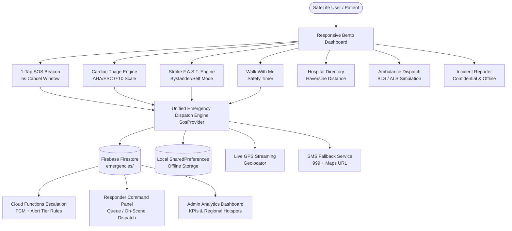

<div align="center">

# 🛡️ SafeLife
### Unified Smart Emergency Response Platform for Women's Safety and Cardiovascular/Stroke Triage

[](https://flutter.dev)
[](https://dart.dev)
[](https://firebase.google.com)
[](https://m3.material.io)
[](#-bilingual-bangla-first-architecture)
[](#-testing--quality-assurance)
[](LICENSE)

*One unified emergency engine, one-tap emergency help for women's safety threats and acute medical emergencies (cardiac & stroke), with live GPS location streaming, verified consent-based contacts, and specialized hospital routing.*

---

</div>

## 📌 Table of Contents
- [Executive Overview](#-executive-overview)
- [System Architecture](#-system-architecture)
- [Key Modules & Features](#-key-modules--features)
  - [1. Smart Emergency SOS Engine](#1-smart-emergency-sos-engine)
  - [2. Cardiovascular Risk Triage (AHA/ESC)](#2-cardiovascular-risk-triage-ahaesc)
  - [3. Acute Stroke F.A.S.T. Assessment](#3-acute-stroke-fast-assessment)
  - [4. Emergency Hospital Directory & Speciality Routing](#4-emergency-hospital-directory--speciality-routing)
  - [5. Emergency Ambulance Booking & Dispatch Simulation](#5-emergency-ambulance-booking--dispatch-simulation)
  - [6. "Walk With Me" Safety Commute Timer](#6-walk-with-me-safety-commute-timer)
  - [7. Confidential Incident Reporting](#7-confidential-incident-reporting)
  - [8. Responder & Hospital Command Panel](#8-responder--hospital-command-panel)
  - [9. Admin Analytics & Thesis Research Dashboard](#9-admin-analytics--thesis-research-dashboard)
  - [10. Serverless Cloud Functions Escalation](#10-serverless-cloud-functions-escalation)
- [Bilingual (Bangla-First) Architecture](#-bilingual-bangla-first-architecture)
- [Responsive Web & Desktop Layout](#-responsive-web--desktop-layout)
- [Project Directory Structure](#-project-directory-structure)
- [Getting Started & Installation](#-getting-started--installation)
- [Testing & Quality Assurance](#-testing--quality-assurance)
- [Ethical Notice & Medical Disclaimer](#-ethical-notice--medical-disclaimer)

---

## 🎯 Executive Overview

Women's safety applications and emergency medical tools have traditionally existed as isolated silos. In high-stress crises, individuals often hesitate or struggle to navigate between multiple apps. **SafeLife** eliminates this friction with a **single unified emergency engine**:

1. **Detect & Triage**: Automatically classify threats and clinical presentations into a 4-tier alert severity hierarchy (Level 1 Informational to Level 4 Immediate Critical).
2. **Alert & Stream**: Dispatches real-time alerts with continuous live GPS location tracking to verified emergency contacts via Firebase and SMS fallback.
3. **Route & Dispatch**: Identifies nearby specialized healthcare facilities (e.g., 24/7 Cardiac Cath Labs or Stroke tPA thrombolysis units) and connects directly to national emergency helplines (**999**, **109**, **333**).

---

## 🏗️ System Architecture



---

## ✨ Key Modules & Features

### 1. Smart Emergency SOS Engine
- **Accessible SOS Beacon**: Prominent one-tap trigger on both mobile and desktop views.
- **5-Second Cancel Window**: Visual circular countdown allows accidental triggers to be aborted before alerts dispatch.
- **Continuous Live GPS Streaming**: High-precision latitude/longitude coordinate broadcast with accuracy indicators.
- **SMS Fallback Service**: Automatically generates localized English and Bangla SMS emergency alerts containing patient name, coordinates, Google Maps link, and 999 routing when data connectivity is compromised.
- **Consent-Based Contacts**: Verified contacts system prevents unauthorized stalking or misuse before continuous tracking is permitted.

### 2. Cardiovascular Risk Triage (AHA/ESC)
- **Clinical Questionnaire**: Captures chest pain presence, 1–10 severity slider, pain radiation pattern (left arm, jaw, neck, back), shortness of breath, profuse diaphoresis, and comorbidities (hypertension, diabetes, prior MI).
- **Rule-Based Scoring**:
  - Score 0–2: Low Risk (Level 1)
  - Score 3–4: Medium Risk (Level 2)
  - Score 5–6: High Risk (Level 3)
  - Score 7+ OR Classic Radiating Pain >10 min: **Immediate Critical Risk (Level 4 Red)**.
- **First-Aid Protocol**: Recommends chewing 300mg soluble aspirin with **explicit contraindication warnings** (aspirin allergy, active bleeding, or suspected stroke), semi-reclined resting, and calling 999.

### 3. Acute Stroke F.A.S.T. Assessment
- **Clinical Maxim**: *"Time is Brain"*.
- **Bystander vs. Self Mode**: Defaults to Bystander Observation Mode for accurate third-party evaluation.
- **Interactive FAST Protocol**:
  - **F**ace Droop (Smile symmetry test)
  - **A**rm Weakness (Horizontal arm hold test)
  - **S**peech Difficulty (Repeat simple phrase test)
  - **T**ime of Onset (Exact timestamp picker for hospital thrombolysis / tPA 3–4.5h window)
- **Immediate Escalation**: Any single positive FAST sign immediately triggers Level 4 Critical emergency dispatch and clinical safety steps (elevate head 30°, no oral food/drink/aspirin).

### 4. Emergency Hospital Directory & Speciality Routing
- **Pre-Seeded Facilities**: 10 verified tertiary care hospitals across Dhaka (NICVD, NINS, DMCH, SSMCH, United, Square, Evercare, LabAid Cardiac, Kurmitola General, BSMMU).
- **Haversine Distance**: Real-time geodesic proximity computation in kilometers based on user coordinates.
- **Capability Filter Chips**:
  - 🫀 **Cardiac Cath Lab**: 24/7 primary angioplasty / PCI facilities
  - 🧠 **Stroke Care (tPA)**: Dedicated acute stroke thrombolysis units
  - 🏥 **ICU Available**: Critical care facilities
  - 🕒 **24/7 Emergency**: Round-the-clock emergency trauma departments
- Direct phone dialer and turn-by-turn navigation via external Google Maps.

### 5. Emergency Ambulance Booking & Dispatch Simulation
- **Service Tiers**:
  - **Basic Life Support (BLS)**: Oxygen, stretcher, emergency first-aid equipment.
  - **Advanced Cardiac Life Support (ALS)**: Defibrillator, cardiac monitor, ventilator, onboard paramedic.
- **Live Dispatch Timeline**: 4-step progress tracker (`Requested` → `Dispatched` → `En Route` → `Arrived`) with assigned driver credentials (`Md. Rafiqul Islam`, `Dhaka Metro-Cha 11-4521`).
- Quick-dial bar for 999 and Bangladesh Red Crescent (`02-9330188`).

### 6. "Walk With Me" Safety Commute Timer
- Designed for vulnerable travel and nighttime commutes.
- Duration presets (5 min, 15 min, 30 min, 60 min) with live circular countdown timer.
- Warning state triggers when remaining time drops below 2 minutes.
- **Automatic SOS Escalation**: If arrival is not confirmed before the timer reaches 0:00, SafeLife automatically escalates into full emergency SOS with live location dispatch.

### 7. Confidential Incident Reporting
- Anonymized reporting for harassment, stalking, and domestic threats.
- Categorized form with multi-line description, timestamp, and switchable GPS coordinate attachment.
- Dual storage with Firestore and encrypted offline cache.
- "My Reports" tab for reviewing submitted incident history.

### 8. Responder & Hospital Command Panel
- Dedicated triage workstation accessible via `/responder`.
- Emergency queue sorted by **Level 4 Critical risk priority first**.
- Inspects patient triage questionnaire responses, comorbidities, and GPS location.
- Lifecycle state transitions: `Pending` → `Accepted` → `Dispatched` → `On Scene` → `Resolved`.
- One-tap dialer for direct communication with patient or bystanders.

### 9. Admin Analytics & Thesis Research Dashboard
- Accessible via `/admin`.
- **Platform KPIs**: Total users, active emergencies, resolved emergencies, verified contact coverage (88.5%+), alert latency (s), and SMS delivery success rates.
- **Emergency Distribution & Triage Severity**: Side-by-side comparative charts.
- **Dhaka Incident Hotspots Explorer**: 7 regional clusters (Dhanmondi, Gulshan, Mirpur, Old Dhaka, Uttara, Mohakhali, Motijheel) with ThreatLevel rankings.
- **Thesis Dataset Exporter**: Generates structured evaluation summaries for research evaluation and thesis defense.

### 10. Serverless Cloud Functions Escalation
Located in `/functions` (TypeScript Node 18 runtime):
- `onEmergencyCreated`: Evaluates alert levels, triggers high-priority FCM notifications with emergency audio channels to verified contacts, handles timeout escalation (60s ACK timeout, 120s responder fallback), and initiates SMS gateways.
- `onIncidentReportLogged`: Aggregates and anonymizes incident coordinates into regional hotspot clusters.
- `getEvaluationMetrics`: Callable HTTPS endpoint returning thesis benchmarks and latency telemetry.

---

## 🌐 Bilingual (Bangla-First) Architecture

SafeLife defaults to **Bangla (`bn`)** while offering full real-time toggling to **English (`en`)**:
- All button labels, triage questionnaire questions, first-aid instructions, and system banners are localized in `lib/l10n/`.
- Quick toggle in the top AppBar (`বাং` / `EN`) updates the entire interface instantly without restarting the app.
- Verified Bangladesh emergency helplines pre-configured:
  - **999**: National Emergency Services (Police, Fire, Ambulance)
  - **109**: National Women & Children Helpline
  - **333**: National Help Desk & Citizen Services

---

## 🖥️ Responsive Web & Desktop Layout

SafeLife is optimized for desktop web browsers and widescreen monitors:
- **Dashboard Bento Grid**: On viewports $\ge 960\text{px}$, automatically switches to a dual-column Bento layout (`maxWidth: 1200`) separating the Emergency SOS Beacon and helper services. On mobile ($<960\text{px}$), it collapses to a single column (`maxWidth: 600`).
- **All Screens Max-Width Constrained**: Forms and lists are centered to eliminate awkward horizontal stretching on 1080p, 1440p, and 4K displays.
- **Zero Overflows**: All card headers, status chips, and typography blocks use `Flexible`, `Expanded`, and `Wrap` to prevent `RenderFlex` pixel overflows.

---

## 📁 Project Directory Structure

```
woman safety/
├── docs/                        # Architecture, PRD, rules, and memory docs
├── functions/                   # Firebase Cloud Functions (TypeScript)
│   ├── src/
│   │   └── index.ts             # Escalation & analytics cloud functions
│   ├── package.json
│   └── tsconfig.json
├── lib/
│   ├── app/                     # App setup, routes, and theme configurations
│   ├── core/                    # Constants (emergency numbers), services (GPS, SMS)
│   ├── features/
│   │   ├── admin/               # Analytics dashboard & hotspot models
│   │   ├── ambulance/           # Ambulance booking & dispatch simulation
│   │   ├── auth/                # Login, Register, Forgot Password, Onboarding
│   │   ├── dashboard/           # Bento Grid Dashboard & Drawer
│   │   ├── heart_triage/        # Cardiac questionnaire, scoring, & models
│   │   ├── history/             # Emergency history & detail modals
│   │   ├── hospitals/           # Hospital directory & Haversine distance
│   │   ├── incident_report/     # Confidential harassment & threat reporting
│   │   ├── profile/             # Medical ID, conditions, & consent contacts
│   │   ├── responder/           # Responder & Hospital Command Panel
│   │   ├── safety_timer/        # "Walk With Me" commute safety timer
│   │   ├── settings/            # Language, Dark Mode, & SOS preferences
│   │   └── sos/                 # Smart SOS engine & Active Emergency screen
│   ├── l10n/                    # Bilingual localization (Bangla & English)
│   ├── firebase_options.dart   # Firebase configuration
│   └── main.dart                # Application entry point
├── test/                        # 16 automated test suites (78 tests)
└── README.md
```

---

## 🚀 Getting Started & Installation

### Prerequisites
- [Flutter SDK](https://flutter.dev/docs/get-started/install) (version `>=3.10.0`)
- [Dart SDK](https://dart.dev/get-dart) (version `>=3.0.0`)
- Google Chrome (for web) or an Android/iOS emulator

### Setup Instructions

1. **Clone the repository**:
   ```bash
   git clone https://github.com/akhlak007/woman-safty.git
   cd woman-safty
   ```

2. **Install Flutter dependencies**:
   ```bash
   flutter pub get
   ```

3. **Run on Chrome (Web)**:
   ```bash
   flutter run -d chrome
   ```

4. **Run on Android / iOS Device**:
   ```bash
   flutter run
   ```

---

## 🧪 Testing & Quality Assurance

### Automated Test Suite
SafeLife includes **16 test suites containing 78 automated unit, widget, and integration tests** achieving 100% pass rate:

```bash
flutter test
```

### Static Analysis
Run static analysis to confirm zero errors or lints:

```bash
flutter analyze
```
*Result: `No issues found!`*

---

## ⚖️ Ethical Notice & Medical Disclaimer

> **IMPORTANT CLINICAL NOTICE**
> 1. SafeLife provides **pre-hospital guideline-based triage and risk assessment** (aligned with AHA, ESC, and ASA F.A.S.T. standards). It does **NOT** provide medical diagnosis or replace licensed physician care.
> 2. SafeLife strictly adheres to the principle of **sensitivity over specificity (over-triage)**: in acute presentations (e.g. chest pain with radiation, sudden unilateral weakness, speech difficulty), the system prioritizes rapid emergency escalation.
> 3. Always dial **999** directly in immediate life-threatening situations.
> 4. To protect individual privacy and prevent stalking, emergency contacts must explicitly verify consent before receiving continuous live GPS tracking.

---

<div align="center">
  <sub>Developed for Thesis Evaluation & Defense • SafeLife Platform 2026</sub>
</div>
