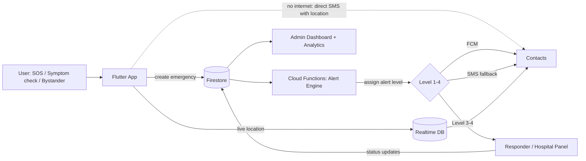

# 🏗️ architecture.md — High-Level Design & Structure

## SafeLife Architecture

### 1. Architecture

**System design overview:**
SafeLife is a client–serverless system. The Flutter app collects events (SOS, symptom checks, incident reports) and sends them to Firebase. **Cloud Functions** own the Alert Engine, so alert logic does not depend on the phone staying alive. Contacts are reached through push notifications first and SMS as a fallback.

**Key design decision:** the app is a *unified emergency engine* with pluggable emergency types (`safety`, `cardiac`, `stroke`, extendable later). Every type produces the same `Emergency` object and flows through the same alert pipeline.

**Components and how they interact:**

| Component | Responsibility |
|---|---|
| Flutter app (Provider) | UI, SOS triggers, symptom questionnaires, location capture, local offline queue |
| Firebase Auth | Identity, session management |
| Cloud Firestore | Profiles, contacts, emergencies, reports, alerts |
| Realtime Database (optional) | High-frequency live-location updates (cheaper than Firestore writes) |
| Cloud Functions | Alert Engine, escalation timers, dedup/retries, SMS dispatch, analytics aggregation |
| Firebase Cloud Messaging | Push notifications to contacts and responders |
| SMS gateway (**TBD**: Twilio / local BD provider) | Fallback alerts without internet on the recipient side |
| Google Maps / Places APIs | Map display, nearby hospitals, tracking links |
| Firebase Storage | Incident evidence (photo/audio) |
| Flutter Web panels | Admin dashboard, responder/hospital panel |
| Crashlytics | Crash and error reporting |

**Flow diagram:**



### 2. Alert Engine Rules (proposed)

| Level | Name | Trigger examples | Actions |
|---|---|---|---|
| 1 | Informational | Low-risk triage result | Show advice to user only; log the case |
| 2 | Emergency Contact Alert | User-triggered SOS (safety); Medium-risk triage | Notify all verified contacts (FCM + SMS) with type, time, location |
| 3 | High Priority | High-risk triage; Level 2 not acknowledged within **N s** | Repeat alerts, prompt user to call emergency services, show nearby hospitals |
| 4 | Critical | Critical cardiac risk; any positive FAST sign; Level 3 not acknowledged within **M s** | All channels, auto-prompt emergency call, ambulance request, responder panel notified |

Rules that apply to all levels: **deduplicate** repeated triggers for the same case, **retry** failed sends, **escalate** if no contact acknowledges, and log every step with timestamps for evaluation. `N` and `M` are configurable constants (**TBD**).

### 3. Risk Scoring Approach (to be validated by a clinician)

> ⚠️ Weights and thresholds below are placeholders. They must come from published clinical guidance and be reviewed by a doctor. Do not invent values.

- **Cardiac triage:** acute symptoms (chest pain, shortness of breath, nausea, excessive sweating, dizziness) combined with profile risk factors (age, diabetes, hypertension, smoking, prior cardiac events) produce a weighted, rule-based score mapped to Low / Medium / High / Critical.
- **Stroke triage:** FAST (Face, Arm, Speech, Time). **Any positive sign = Emergency**, with no scoring delay. Supports self-check and bystander mode.
- **Design principle:** over-triage. Favor sensitivity over specificity, and always show "Call emergency services now" for High/Critical.
- **Explainability:** every result stores the answers and the rule that fired.

### 4. Firestore Data Model (draft)

```
users/{uid}
  name, phone, bloodGroup, medicalHistory[], medications[], allergies[], language, createdAt
  contacts/{contactId}        name, phone, relation, verified, priority
emergencies/{emergencyId}
  userId, type (safety|cardiac|stroke), riskLevel, alertLevel, status (active|resolved|cancelled|false_alarm)
  createdAt, resolvedAt, lastKnownLocation{lat,lng,accuracy,ts}, triggerSource, triageAnswers{}
  alerts/{alertId}            channel (fcm|sms), recipient, status (sent|delivered|acked|failed), ts
ambulanceRequests/{requestId} emergencyId, status (requested|accepted|on_the_way|arrived), updatedAt
incidentReports/{reportId}    userId, category, description, location, evidenceUrls[], createdAt
hospitals/{hospitalId}        name, location, phone   (optional cache of Places results)
analytics/{docId}             anonymized daily aggregates written by Cloud Functions
```

Live location points go to Realtime Database under `liveLocation/{emergencyId}`, throttled (e.g. every 5–10 s), and are deleted per the retention policy.

### 5. Folder & File Structure

```
safelife/
├── lib/
│   ├── main.dart
│   ├── app/                    # app widget, routes, theme, localization
│   ├── core/
│   │   ├── constants/          # emergency numbers, alert thresholds
│   │   ├── services/           # location, sms, notification, connectivity
│   │   ├── utils/
│   │   └── widgets/            # shared UI (SOS button, cards)
│   ├── features/
│   │   ├── auth/               # data / providers / screens
│   │   ├── profile/            # medical info, emergency contacts
│   │   ├── sos/                # SOS button, countdown, live tracking
│   │   ├── incident_report/
│   │   ├── heart_triage/       # questionnaire + scoring engine
│   │   ├── stroke_triage/      # FAST + bystander mode
│   │   ├── hospitals/          # nearby hospital finder
│   │   ├── ambulance/          # request + status (simulated)
│   │   └── history/
│   └── l10n/                   # en, bn
├── functions/                  # Cloud Functions (alert engine, escalation, SMS)
├── admin_web/                  # Flutter Web: admin + responder panels
├── firebase/                   # firestore.rules, storage.rules, indexes
├── test/
├── docs/                       # PRD, architecture, design, rules, phases, memory
└── pubspec.yaml
```

### 6. Tech Stack

- **Frontend:** Flutter, Material 3
- **State management:** Provider
- **Backend:** Firebase Authentication, Cloud Firestore, Firebase Cloud Messaging, Cloud Functions, Firebase Storage, Realtime Database (live tracking)
- **Services:** Google Maps SDK, Places API, device location services, SMS gateway (**TBD**)
- **Hosting / Deployment:** Firebase Hosting for web panels; Android APK / Play internal testing for the app
- **Other tools/libraries:** Crashlytics, GitHub for version control and CI (**TBD**)
